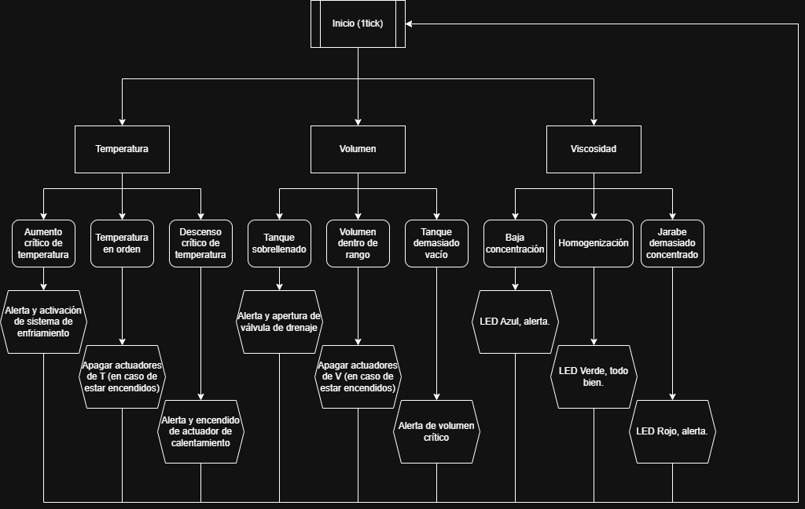

# Simulación IoT: Control y Monitoreo de Contenedor de Jarabe Farmacéutico

Este repositorio contiene la arquitectura, código y configuración para un sistema de automatización inteligente aplicado a un contenedor de jarabe farmacéutico. 

El proyecto simula el control de variables físicas, gestión de actuadores mediante **AWS Device Shadow**, registro de métricas en **DynamoDB**, alertas por **SNS**, y telemetría visualizada en un Dashboard de **Node-RED**, usando una **ESP32 simulada en Wokwi** como el borde (Edge).

## Arquitectura del Sistema

1. **Hardware / Edge (Wokwi - ESP32 con MicroPython):** Simula los sensores del contenedor y controla los actuadores (LEDs indicadores, Buzzer, relés virtuales) reaccionando al estado reportado (`reported`) del Device Shadow y a las reglas locales.
2. **Bróker y Lógica en la Nube (AWS IoT Core):**
   * **MQTT Topics:** Recepción de telemetría y eventos.
   * **Device Shadow:** Sincronización de estado (`desired` → `delta` → `reported`) para controlar enfriadores, calentadores, válvulas y bombas.
   * **AWS Rules:** Enrutamiento de datos hacia la base de datos y alertas.
3. **Almacenamiento y Notificaciones (AWS DynamoDB & SNS):**
   * **DynamoDB:** Guarda un registro histórico de todos los eventos de cambio de estado.
   * **SNS:** Envía correos electrónicos inmediatos al personal cuando se activa una emergencia.
4. **Controlador, UI y Simulación Física (Node-RED):** Injecta variables físicas para la simulación

---

## 📋 Tabla de Eventos (Diseño y Clasificación)

El sistema maneja eventos divididos en dos categorías, cumpliendo con la regla de desduplicación (dedupe) para no generar spam: solo se dispara la acción y el registro cuando el estado cambia (ej. de `OK` a `ALERTA`).

| ID | Nombre del Evento | Tipo de Evento | Severidad | Condición de Disparo | Acción del Sistema (Shadow / Emergencia) | Registro (DynamoDB / SNS) |
| :--- | :--- | :--- | :--- | :--- | :--- | :--- |
| **EV1** | **Temperatura ALTA** | Shadow (Control) | Grave | Temp > 25°C | `desired` enfriamiento: ON. | DynamoDB: Sí |
| **EV2** | **Temperatura BAJA** | Shadow (Control) | Moderada | Temp < 20°C | `desired` calentamiento: ON. | DynamoDB: Sí |
| **EV3** | **Sobrellenado** | Shadow (Control) | Moderada | Volumen > 85% | `desired` válvula_salida: ON (Drenaje). | DynamoDB: Sí |
| **EV4** | **Volumen Bajo**| Físico | Baja | Volumen < 20% | Publica en topic de emergencia / Buzzer ON. | DynamoDB: Sí / SNS: Email |
| **EV5** | **Concentración Anómala** | Shadow (Control) | Moderada | Brix < 64 o > 67 | `desired` Alerta, cambia LED. | DynamoDB: Sí |

Notas adicionales respecto a la tabla: 
1. Las aspas siempre van a estar encendidas ya que a través de la potencia requerida de las aspas al mezclar se obtiene un estimado de la concentración, la cuál alertará al personal para hacer los cambios necesarios
2. Los grados Brix son una unidad de cantidad (símbolo °Bx) y sirven para determinar el cociente total de materia seca (generalmente azúcares) disuelta en un líquido. Una solución de 25 °Bx contiene 25 g de sólido disuelto por 100 g de disolución total. (fuentes- wikipedia)

